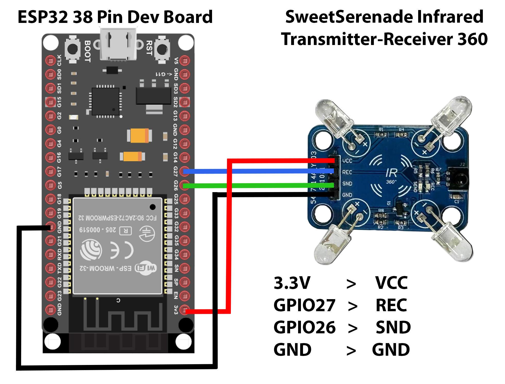
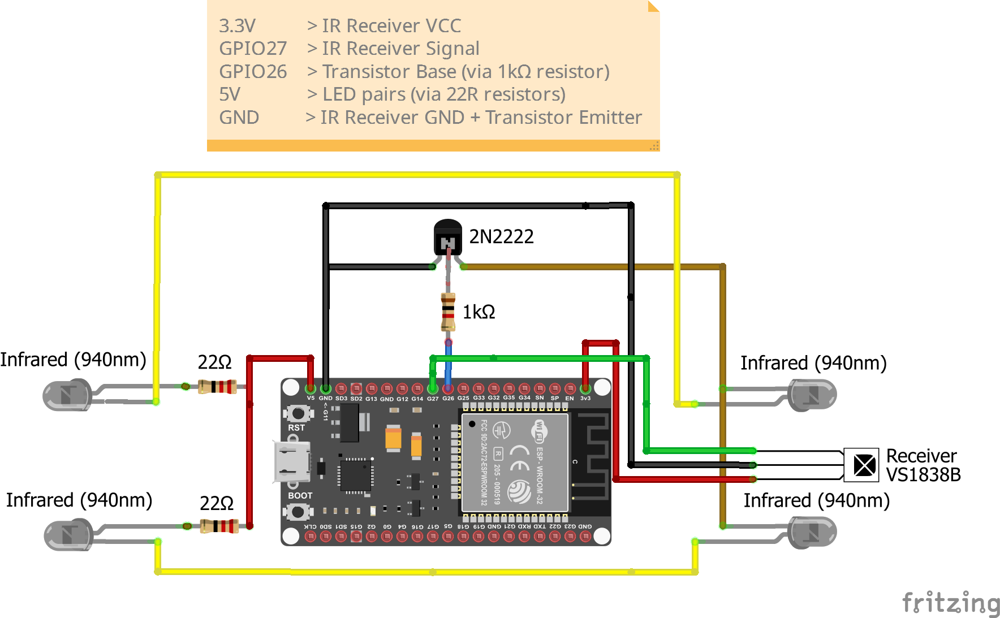

# Infrared (IR) in Home Assistant – Make Dumb Devices Smart with ESPHome

In this video I'll show you how to integrate IR control into ESPHome and Home Assistant.
We'll clone an existing remote, create buttons to control devices like TVs and air conditioning, and set up automations so Home Assistant can do it all for you.

## Watch the video here:
▶️ [Infrared (IR) in Home Assistant – Make Dumb Devices Smart with ESPHome](https://youtu.be/V0-YWqsJjTc)

&nbsp;
## All in One Wiring Diagram
<p align="center">
  
</p>

## DIY Wiring Diagram
<p align="center">

</p>

## ESPHome sample code used in this video
&nbsp;
## Device Setup Template — just the ESP32 basics, no IR

```yaml
esphome:
  name: your-device-name        # e.g. ir-hub-lounge (lowercase, hyphens only)
  friendly_name: Your Device Name  # e.g. IR Hub Lounge (displays in Home Assistant)

esp32:
  board: esp32dev      # change if using a different ESP32 board - full list: https://registry.platformio.org/platforms/platformio/espressif32/boards
  framework:
    type: esp-idf      # recommended - change to arduino if you experience compatibility issues
    # Framework guide: https://esphome.io/components/esp32/#framework

# Enable logging
logger:

# Enable Home Assistant API
api:
  encryption:
    key: "YOUR_ENCRYPTION_KEY"

ota:
  - platform: esphome
    password: "YOUR_OTA_PASSWORD"

wifi:
  ssid: !secret wifi_ssid
  password: !secret wifi_password

# Enable fallback hotspot (captive portal) in case wifi connection fails
  ap:
    ssid: "Your-Device Fallback Hotspot"
    password: "YOUR_AP_PASSWORD"

captive_portal:

##################################
# REMOTE RECEIVER GOES HERE
# https://esphome.io/components/remote_receiver/
##################################


##################################
# REMOTE RECEIVER SETTINGS GO HERE
##################################


##################################
# REMOTE TRANSMITTER GOES HERE
# https://esphome.io/components/remote_transmitter/
##################################


##################################
# BINARY SENSORS GO HERE
##################################

binary_sensor:

##################################
# BUTTONS GO HERE
##################################

button:

##################################
# AUTOMATIONS GO HERE
# https://esphome.io/components/remote_transmitter/#automations
##################################


```
&nbsp;
## Remote receiver
```yaml
remote_receiver:
  pin:
    number: GPIO_PIN    # replace with your receiver pin e.g. GPIO27
    inverted: true      # default: false - set to true for most IR receiver modules (active-low signal)
    mode:               # required when setting pullup - defines pin behaviour
      input: true       # always true for a receiver pin
      pullup: true      # enables internal pull-up resistor - required for some modules e.g. TSOP38238
  dump: all  # comment this out and uncomment dump: below to filter specific protocols
# Full protocol list: https://esphome.io/components/remote_receiver/
```
&nbsp;
## Remote receiver settings
```yaml
#  dump:
#    - aeha         # AEHA infrared codes
#    - beo4         # B&O Beo4 infrared codes
#    - canalsat     # CanalSat infrared codes (56kHz)
#    - canalsatld   # CanalSatLD infrared codes (56kHz)
#    - coolix       # Coolix infrared codes
#    - dish         # Dish infrared codes (57.6kHz - many receivers won't decode)
#    - dyson        # Dyson Cool AM7 fan codes
#    - jvc          # JVC infrared codes
#    - gobox        # Go-Box infrared codes
#    - haier        # Haier infrared codes
#    - lg           # LG infrared codes
#    - magiquest    # MagiQuest wand infrared codes
#    - midea        # Midea infrared codes
#    - nec          # NEC infrared codes (most common - cheap/generic remotes)
#    - panasonic    # Panasonic infrared codes
#    - pioneer      # Pioneer infrared codes
#    - rc5          # RC5 infrared codes
#    - rc6          # RC6 infrared codes
#    - roomba       # Roomba infrared codes
#    - samsung      # Samsung infrared codes
#    - samsung36    # Samsung36 infrared codes
#    - symphony     # Symphony infrared codes
#    - sony         # Sony infrared codes
#    - toshiba_ac   # Toshiba AC infrared codes
#    - mirage       # Mirage infrared codes
#    - toto         # Toto infrared codes
#    - pronto       # Universal raw format - use if no protocol matches
#    - raw          # Raw timing dump - last resort fallback


# ----------------------------------------------------------
# Tolerance - how much signal timing can deviate before failing to decode
# Default: 25% - increase if signals are inconsistent or noisy
  tolerance: 25%
# Or use time based tolerance instead (comment out line above and uncomment below)
#  tolerance:
#    type: time
#    value: 500us  # microseconds (us) - 1000us = 1ms


# ----------------------------------------------------------
# Buffer size - internal memory for storing received codes
# Default: 10kb on ESP32, 1kb on ESP8266 - increase if missing signals
  buffer_size: 10kb

# ----------------------------------------------------------
# Filter - ignore pulses shorter than this (removes noise/glitches)
# Default: 50us - increase if getting false triggers from interference
# Range: 0 to 4294967295us (1000us = 1ms)
  filter: 50us

# ----------------------------------------------------------
# Idle - how long signal must be stable to be considered complete
# Default: 10ms (10000us) - the signal is considered finished after this period of silence
# Maximum values (1000us = 1ms):
# ESP32 / ESP32-S2:                65536us (~65ms)
# Other ESP32 variants (RMT):      32767us (~32ms)
# All other platforms (incl C2/C61): 4294967295us
  idle: 10ms

# ----------------------------------------------------------
# ID - manually specify an ID for this receiver
# Only needed if you have multiple receivers on the same device
# Example:
#  id: ir_receiver_1

# ----------------------------------------------------------
# ESP32 RMT HARDWARE SETTINGS
# Only applies to ESP32 variants with RMT hardware
# NOT available on ESP32-C2 and ESP32-C61
# Leave commented unless experiencing memory conflicts
# More info: https://esphome.io/components/remote_receiver/

# rmt_symbols - RMT hardware memory allocation
#  rmt_symbols: 64  # [uncomment to use]

# receive_symbols - maximum receive length in symbols
#  receive_symbols: 64  # [uncomment to use]

# filter_symbols - ignore received data shorter than this (filters noise bursts)
#  filter_symbols: 4  # [uncomment to use]

# clock_resolution - RMT peripheral clock speed in Hz
# Default: 1000000
#  clock_resolution: 1000000  # [uncomment to use]

# use_dma - enable Direct Memory Access (only on supported variants)
# If enabled rmt_symbols controls the DMA buffer size
#  use_dma: false  # [uncomment to use]


# ----------------------------------------------------------
# SIGNAL DEMODULATION
# Only needed if connecting a raw IR photodiode directly to ESP32
# Standard IR receiver modules (VS1838B etc) already demodulate the signal
# Most users will never need this - leave commented
# More info: https://esphome.io/components/remote_receiver/

# carrier_duty_percent - carrier duty cycle for demodulation (%)
# Default: 100
#  carrier_duty_percent: 100  # [uncomment to use]

# carrier_frequency - carrier frequency for demodulation in Hz
# Default: 0 (disabled)
#  carrier_frequency: 38000  # [uncomment to use] 38kHz is standard for most IR
```
&nbsp;
## Remote transmitter
```yaml
remote_transmitter:
  pin: GPIO_PIN               # replace with your transmitter pin e.g. GPIO26
  carrier_duty_percent: 50%   # 50% for IR LEDs, 100% for RF (433MHz)
```
&nbsp;
## 📡 Binary sensors
⚠️ These go under <code><b>binary_sensor:</b></code> in your ESPHome config
&nbsp;
## Binary sensor connection status

```yaml
# DEVICE STATUS - confirms device is online in Home Assistant
  - platform: status
    name: "Status"
```
&nbsp;
## 🔘 Button Examples by Brand/Protocol
⚠️ These go under <code><b>button:</b></code> in your ESPHome config
&nbsp;
## Restart button
```yaml
# BUILT IN BUTTONS
  - platform: restart
    name: "Restart"
```

## Samsung - Button Template
```yaml
  - platform: template
    name: "NAME_OF_BUTTON"  # ← this can be anything you like
    on_press:
      - remote_transmitter.transmit_samsung:  # ← this is fixed
          data: DATA_ID
          nbits: 32
```
## NEC - Button Template
```yaml
  - platform: template
    name: "NAME_OF_BUTTON"  # ← this can be anything you like
    on_press:
      - remote_transmitter.transmit_nec:
          address: ADDRESS_ID
          command: COMMAND_ID
```

## LG - Button Template
```yaml
  - platform: template
    name: "NAME_OF_BUTTON"  # ← this can be anything you like
    on_press:
      - remote_transmitter.transmit_lg:
          data: DATA_ID
          nbits: 32
```

## Pronto - Button Template
```yaml
  - platform: template
    name: "NAME_OF_BUTTON"  # ← this can be anything you like
    on_press:
      - remote_transmitter.transmit_pronto:
          data: DATA_ID
```
## RAW - Button Template
```yaml
  - platform: template
    name: "NAME_OF_BUTTON"  # ← this can be anything you like
    on_press:
      - remote_transmitter.transmit_raw:
          carrier_frequency: 38kHz  # 38kHz is standard for most IR devices
          code: ENTER_CODE_HERE
```
## Brightness Buttons (with Percentage Presets)
⚠️ These buttons are calibrated for a light remote with 12 brightness levels. Adjust the repeat counts to match your own remote.
&nbsp;

```yaml
##################################
# BRIGHTNESS BUTTONS
##################################


  - platform: template
    name: "Brightness Up"  # ← this can be anything you like
    on_press:
      - remote_transmitter.transmit_nec:

          # Replace with the address from your own IR remote
          address: 0xDEA8

          # Replace this with your own brightness up command
          command: 0xFF00

  - platform: template
    name: "Brightness Down"  # ← this can be anything you like
    on_press:
      - remote_transmitter.transmit_nec:

          # Replace with the address from your own IR remote
          address: 0xDEA8
          
          # Replace this with your own brightness down command
          command: 0xF20D

##################################
# BRIGHTNESS PERCENTAGE BUTTONS - START
##################################

  - platform: template
    name: "Lounge Light 20%"
    on_press:
      - repeat:
          count: 20        # press up to minimum brightness - no up presses needed
          then:
            - remote_transmitter.transmit_nec:
                # Replace with the address from your own IR remote
                address: 0xDEA8

                # Replace this with your own brightness down command
                command: 0xF20D
            - delay: 100ms


  - platform: template
    name: "Lounge Light 40%"
    on_press:
      then:
        - remote_transmitter.transmit_nec:
           
           # Replace with the address from your own IR remote
            address: 0xDEA8

            # Replace this with your own brightness up command
            command: 0xFF00
            repeat:
              times: 20
              wait_time: 100ms
        - delay: 500ms
        - remote_transmitter.transmit_nec:

            # Replace with the address from your own IR remote
            address: 0xDEA8

            # Replace this with your own brightness down command
            command: 0xF20D
            command_repeats: 3
            repeat:
              times: 8
              wait_time: 200ms


  - platform: template
    name: "Lounge Light 60%"
    on_press:
      then:
        - remote_transmitter.transmit_nec:

            # Replace with the address from your own IR remote
            address: 0xDEA8

            # Replace this with your own brightness up command
            command: 0xFF00
            repeat:
              times: 20
              wait_time: 100ms
        - delay: 500ms
        - remote_transmitter.transmit_nec:

            # Replace with the address from your own IR remote
            address: 0xDEA8

            # Replace this with your own brightness down command
            command: 0xF20D
            command_repeats: 3
            repeat:
              times: 5
              wait_time: 200ms


  - platform: template
    name: "Lounge Light 80%"
    on_press:
      then:
        - remote_transmitter.transmit_nec:

            # Replace with the address from your own IR remote
            address: 0xDEA8

            # Replace this with your own brightness up command
            command: 0xFF00
            repeat:
              times: 20
              wait_time: 100ms
        - delay: 500ms
        - remote_transmitter.transmit_nec:

            # Replace with the address from your own IR remote
            address: 0xDEA8

            # Replace this with your own brightness down command
            command: 0xF20D
            command_repeats: 3
            repeat:
              times: 2
              wait_time: 200ms


  - platform: template
    name: "Lounge Light 100%"
    on_press:
      - repeat:
          count: 20        # press up to maximum brightness - no down presses needed
          then:
            - remote_transmitter.transmit_nec:

                # Replace with the address from your own IR remote
                address: 0xDEA8

                # Replace this with your own brightness up command
                command: 0xFF00
            - delay: 100ms


##################################
# BRIGHTNESS PERCENTAGE BUTTONS - END
##################################
```

&nbsp;
## Full IR Setup Template — everything included, ready to go
```yaml
esphome:
  name: your-device-name        # e.g. ir-hub-lounge (lowercase, hyphens only)
  friendly_name: Your Device Name  # e.g. IR Hub Lounge (displays in Home Assistant)

esp32:
  board: esp32dev      # change if using a different ESP32 board - full list: https://registry.platformio.org/platforms/platformio/espressif32/boards
  framework:
    type: esp-idf      # recommended - change to arduino if you experience compatibility issues
    # Framework guide: https://esphome.io/components/esp32/#framework

# Enable logging
logger:

# Enable Home Assistant API
api:
  encryption:
    key: "YOUR_ENCRYPTION_KEY"

ota:
  - platform: esphome
    password: "YOUR_OTA_PASSWORD"

wifi:
  ssid: !secret wifi_ssid
  password: !secret wifi_password

# Enable fallback hotspot (captive portal) in case wifi connection fails
  ap:
    ssid: "Your-Device Fallback Hotspot"
    password: "YOUR_AP_PASSWORD"

captive_portal:

##################################
# REMOTE RECEIVER GOES HERE
# https://esphome.io/components/remote_receiver/
##################################

remote_receiver:
  pin:
    number: GPIO_PIN    # replace with your receiver pin e.g. GPIO27
    inverted: true      # default: false - set to true for most IR receiver modules (active-low signal)
    mode:               # required when setting pullup - defines pin behaviour
      input: true       # always true for a receiver pin
      pullup: true      # enables internal pull-up resistor - required for some modules e.g. TSOP38238
  dump: all  # comment this out and uncomment dump: below to filter specific protocols
# Full protocol list: https://esphome.io/components/remote_receiver/

##################################
# REMOTE RECEIVER SETTINGS GO HERE
##################################

#  dump:
#    - aeha         # AEHA infrared codes
#    - beo4         # B&O Beo4 infrared codes
#    - canalsat     # CanalSat infrared codes (56kHz)
#    - canalsatld   # CanalSatLD infrared codes (56kHz)
#    - coolix       # Coolix infrared codes
#    - dish         # Dish infrared codes (57.6kHz - many receivers won't decode)
#    - dyson        # Dyson Cool AM7 fan codes
#    - jvc          # JVC infrared codes
#    - gobox        # Go-Box infrared codes
#    - haier        # Haier infrared codes
#    - lg           # LG infrared codes
#    - magiquest    # MagiQuest wand infrared codes
#    - midea        # Midea infrared codes
#    - nec          # NEC infrared codes (most common - cheap/generic remotes)
#    - panasonic    # Panasonic infrared codes
#    - pioneer      # Pioneer infrared codes
#    - rc5          # RC5 infrared codes
#    - rc6          # RC6 infrared codes
#    - roomba       # Roomba infrared codes
#    - samsung      # Samsung infrared codes
#    - samsung36    # Samsung36 infrared codes
#    - symphony     # Symphony infrared codes
#    - sony         # Sony infrared codes
#    - toshiba_ac   # Toshiba AC infrared codes
#    - mirage       # Mirage infrared codes
#    - toto         # Toto infrared codes
#    - pronto       # Universal raw format - use if no protocol matches
#    - raw          # Raw timing dump - last resort fallback


# ----------------------------------------------------------
# Tolerance - how much signal timing can deviate before failing to decode
# Default: 25% - increase if signals are inconsistent or noisy
  tolerance: 25%
# Or use time based tolerance instead (comment out line above and uncomment below)
#  tolerance:
#    type: time
#    value: 500us  # microseconds (us) - 1000us = 1ms


# ----------------------------------------------------------
# Buffer size - internal memory for storing received codes
# Default: 10kb on ESP32, 1kb on ESP8266 - increase if missing signals
  buffer_size: 10kb

# ----------------------------------------------------------
# Filter - ignore pulses shorter than this (removes noise/glitches)
# Default: 50us - increase if getting false triggers from interference
# Range: 0 to 4294967295us (1000us = 1ms)
  filter: 50us

# ----------------------------------------------------------
# Idle - how long signal must be stable to be considered complete
# Default: 10ms (10000us) - the signal is considered finished after this period of silence
# Maximum values (1000us = 1ms):
# ESP32 / ESP32-S2:                65536us (~65ms)
# Other ESP32 variants (RMT):      32767us (~32ms)
# All other platforms (incl C2/C61): 4294967295us
  idle: 10ms

# ----------------------------------------------------------
# ID - manually specify an ID for this receiver
# Only needed if you have multiple receivers on the same device
# Example:
#  id: ir_receiver_1

# ----------------------------------------------------------
# ESP32 RMT HARDWARE SETTINGS
# Only applies to ESP32 variants with RMT hardware
# NOT available on ESP32-C2 and ESP32-C61
# Leave commented unless experiencing memory conflicts
# More info: https://esphome.io/components/remote_receiver/

# rmt_symbols - RMT hardware memory allocation
#  rmt_symbols: 64  # [uncomment to use]

# receive_symbols - maximum receive length in symbols
#  receive_symbols: 64  # [uncomment to use]

# filter_symbols - ignore received data shorter than this (filters noise bursts)
#  filter_symbols: 4  # [uncomment to use]

# clock_resolution - RMT peripheral clock speed in Hz
# Default: 1000000
#  clock_resolution: 1000000  # [uncomment to use]

# use_dma - enable Direct Memory Access (only on supported variants)
# If enabled rmt_symbols controls the DMA buffer size
#  use_dma: false  # [uncomment to use]


# ----------------------------------------------------------
# SIGNAL DEMODULATION
# Only needed if connecting a raw IR photodiode directly to ESP32
# Standard IR receiver modules (VS1838B etc) already demodulate the signal
# Most users will never need this - leave commented
# More info: https://esphome.io/components/remote_receiver/

# carrier_duty_percent - carrier duty cycle for demodulation (%)
# Default: 100
#  carrier_duty_percent: 100  # [uncomment to use]

# carrier_frequency - carrier frequency for demodulation in Hz
# Default: 0 (disabled)
#  carrier_frequency: 38000  # [uncomment to use] 38kHz is standard for most IR

##################################
# REMOTE TRANSMITTER GOES HERE
# https://esphome.io/components/remote_transmitter/
##################################

remote_transmitter:
  pin: GPIO_PIN               # replace with your transmitter pin e.g. GPIO26
  carrier_duty_percent: 50%   # 50% for IR LEDs, 100% for RF (433MHz)

##################################
# BINARY SENSORS GO HERE
##################################

binary_sensor:

# DEVICE STATUS - confirms device is online in Home Assistant
  - platform: status
    name: "Status"

##################################
# BUTTONS GO HERE
##################################

button:

# BUILT IN BUTTONS
  - platform: restart
    name: "Restart"

##################################
# AUTOMATIONS GO HERE
# https://esphome.io/components/remote_transmitter/#automations
##################################
```

&nbsp;
## AC Control with Auto Off Timer
```yaml
##################################
# GLOBALS
# Variables stored in memory to track AC timer state
# ac_timer_running: whether timer is active
# ac_timer_remaining: minutes remaining on timer
##################################

globals:
  - id: ac_timer_running
    type: bool
    restore_value: no
    initial_value: 'false'

  - id: ac_timer_remaining
    type: int
    restore_value: no
    initial_value: '0'

##################################
# NUMBERS
# Creates a slider in Home Assistant to set timer duration
##################################

number:
  - platform: template
    name: "AC Timer"
    id: ac_timer_duration
    min_value: 5
    max_value: 120
    step: 5
    initial_value: 30
    unit_of_measurement: min
    optimistic: true
    icon: mdi:timer

 ##################################
# TEXT SENSORS
# Shows text based state values in Home Assistant
# AC Timer Status displays minutes remaining or Off
##################################

text_sensor:
  - platform: template
    name: "AC Timer Status"
    id: ac_timer_status
    icon: mdi:timer

##################################
# BINARY SENSORS GO HERE
# Shows on/off state values in Home Assistant
##################################

binary_sensor:

# DEVICE STATUS - confirms device is online in Home Assistant
  - platform: status
    name: "Status"

# AC STATUS - tracks whether AC is on or off
# Note: reflects what ESPHome has sent, not the physical AC state
# If AC is controlled manually via original remote this will be incorrect
  - platform: template
    name: "AC Status"
    id: ac_status
    icon: mdi:air-conditioner

##################################
# INTERVAL
# Runs every 60 seconds to count down the AC timer
# Only acts if AC timer is running
##################################

interval:
  - interval: 60s
    then:
      - if:
          condition:
            lambda: 'return id(ac_timer_running) && id(ac_timer_remaining) > 0;'
          then:
            - globals.set:
                id: ac_timer_remaining
                value: !lambda 'return id(ac_timer_remaining) - 1;'
            - text_sensor.template.publish:
                id: ac_timer_status
                state: !lambda 'return to_string(id(ac_timer_remaining)) + " min remaining";'
            - if:
                condition:
                  lambda: 'return id(ac_timer_remaining) == 0;'
                then:
                  # Send AC off command when timer expires
                  - remote_transmitter.transmit_nec:
                      address: 0x1234
                      command: 0x9ABC
                  - globals.set:
                      id: ac_timer_running
                      value: 'false'
                  - binary_sensor.template.publish:
                      id: ac_status
                      state: false
                  - text_sensor.template.publish:
                      id: ac_timer_status
                      state: "Off"

##################################
# BUTTONS GO HERE
##################################

button:

# BUILT IN BUTTONS
  - platform: restart
    name: "Restart"

# AC CONTROL BUTTONS
# Replace address and command values with your scanned AC remote codes
  - platform: template
    name: "AC On"
    on_press:
      - binary_sensor.template.publish:
          id: ac_status
          state: true
      - remote_transmitter.transmit_nec:
          address: 0x1234  # replace with your scanned AC address
          command: 0x5678  # replace with your scanned AC on command

  - platform: template
    name: "AC Off"
    on_press:
      - globals.set:
          id: ac_timer_running
          value: 'false'
      - binary_sensor.template.publish:
          id: ac_status
          state: false
      - text_sensor.template.publish:
          id: ac_timer_status
          state: "Off"
      - remote_transmitter.transmit_nec:
          address: 0x1234  # replace with your scanned AC address
          command: 0x9ABC  # replace with your scanned AC off command

# Turns AC on and auto off after duration set by AC Timer slider
# Note: timer accuracy is within ~60 seconds due to interval timing
  - platform: template
    name: "AC On with Timer"
    on_press:
      - binary_sensor.template.publish:
          id: ac_status
          state: true
      - globals.set:
          id: ac_timer_running
          value: 'true'
      - globals.set:
          id: ac_timer_remaining
          value: !lambda 'return id(ac_timer_duration).state;'
      - text_sensor.template.publish:
          id: ac_timer_status
          state: !lambda 'return to_string(id(ac_timer_remaining)) + " min remaining";'
      - remote_transmitter.transmit_nec:
          address: 0x1234  # replace with your scanned AC address
          command: 0x5678  # replace with your scanned AC on command
```
&nbsp;
## 🤖 Automations
⚠️ These go in your Home Assistant automations, not ESPHome
&nbsp;
## IR TV Control Automation
```yaml
alias: IR TV Control
description: Doorbell-triggered TV mute and automatic TV power off when away.

triggers:

  # Trigger 1:
  # Detect when either the front door or hallway doorbell sensor changes to ON
  - trigger: state
    entity_id:
      - YOUR_FRONT_DOOR_DING_SENSOR
      - YOUR_HALL_DING_SENSOR
    to:
      - "on"
    id: "1"

  # Trigger 2:
  # Detect when a person has been away from home for 2 minutes    
  - trigger: state
    entity_id:
      - person.YOUR_PERSON_ENTITY
    for:
      hours: 0
      minutes: 2
      seconds: 0
    from:
      - home
    id: "2"
conditions: []
actions:
  - choose:

      # If Trigger 1 fired (doorbell pressed)  
      - conditions:
          - condition: trigger
            id:
              - "1"
        sequence:

          # Send IR mute command to the TV        
          - action: button.press
            metadata: {}
            target:
              entity_id:
                - button.YOUR_TV_MUTE_BUTTON
            data: {}
          - delay:
          # Prevent the automation from running again for 5 minutes
          # while in single mode to avoid repeated mute commands          
              hours: 0
              minutes: 5
              seconds: 0
              milliseconds: 0

      # If Trigger 2 fired (person away for 2 minutes)             
      - conditions:
          - condition: trigger
            id:
              - "2"
        sequence:

          # Send IR power off command to the TV        
          - action: button.press
            metadata: {}
            target:
              entity_id: button.YOUR_TV_POWER_OFF_BUTTON
            data: {}

# Only allow one instance of this automation at a time
mode: single
```
